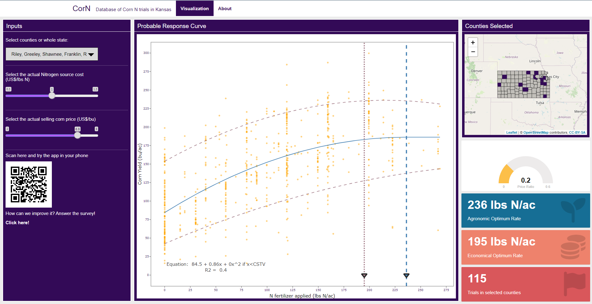

# CorN - <small>A dashboard to simulate the optimum economical and agricultural nitrogen fertilizer for corn in Kansas</small>

## Table of Contents
1. [Objective](#objective)
2. [Data and data manipulation](#data-and-data-manipulation)
3. [Description](#description)
4. [Structure](#structure)
5. [Libraries](#libraries)
6. [CSS](#css)
7. [How it works](#how-it-works)
9. [About](#about)
9. [Future Works](#future-works)
10. [Acknowledgments](#acknowledgments)

---

## Objective

The objective of this dashboard was to generate an interactive platform to simulate economical and agricultural optimal scenarios for nitrogen fertilization in corn in the state of Kansas.

The dashboard is online and can be used through this [link](https://ciampittilab.shinyapps.io/CorN)

---

## Data and data manipulation

The data used on this tool was gathered from 115 works developed by KSU personnel among different years and counties across Kansas.

---

## Description

The framework chosen to build the app was Shiny using R computational language due to the facilitation of the creation and usage of an interactive and free-to-use dashboard.

The main idea to display the data was a left sidebar, a main screen, and a right sidebar. In the left sidebar, users can:

1. Select the county;
2. Nitrogen source cost;
3. Corn selling price.

On the main screen is the graphic with the points representing the nitrogen fertilizer applied vs the corn yield, the quadratic plateau equation and curve, and the vertical lines representing economical and agronomical optimum rates.

The right sidebar has:

1. Kansas counties map highlighting the selected district;
2. A gauge showing the price ratio;
3. The agronomic optimum rate card;
4. The economical optimum rate card;
5. The number of trials in the selected counties.

Screenshot of the dashboard

---

## Structure

The app was developed using the **flexdashboard** library and Rmd file format to facilitate the assembly of the app "skeleton". The CSS and the R file for the functions were made in a separate file and embedded in the app. The R file with the functions was used to generate the quadratic plateau function. There are 3 "son" folders containing files used in the app:
- data: containing all the CSV and XLSX files used;
- www: all the images;
- css: containing the CSS file.

---

## Libraries

15 libraries were used in the app:

| Purpose | Libraries | 
| ----------- | ----------- |
| Shiny framework usage | shiny; flexdashboard; shinydashboard; shinythemes; shinyWidgets |
| Map usage | leaflet; sf; tigris|
| Data manipulation | dplyr; tidyverse |
| Graph usage | ggplot2; plotly; quantreg; nlstools |
| Quadratic plateau | nlraa |

---

## CSS

In the CSS file, there are modifications for the app to:
- Styles for the bootstrap widgets for Shiny;
- Adaptations for usage in small screens;
- Font and colors;
- Shiny error messages hiding;
- Gauge background

---

## How it works

By user selections in the left sidebar widgets, the data of interest is filtered. After filtering, the data is inserted in the quadratic plateau function, the optimums are calculated and everything is output for users.

---

## About

The About section has links guiding users to my and Adrian's Github, our lab website and to Kansas State Univeristy website main page. There is also a small description of the app.

---

## Future Works

Improve the data analysis and merge with the CornInsight app.

---

## Acknowledgments

The app was made by Gustavo N. Santiago and Adrian Correndo (both from Ciampitti Lab at Kansas State University) for a presentation for Kansas Corn.

This study was supported by Kansas Corn.